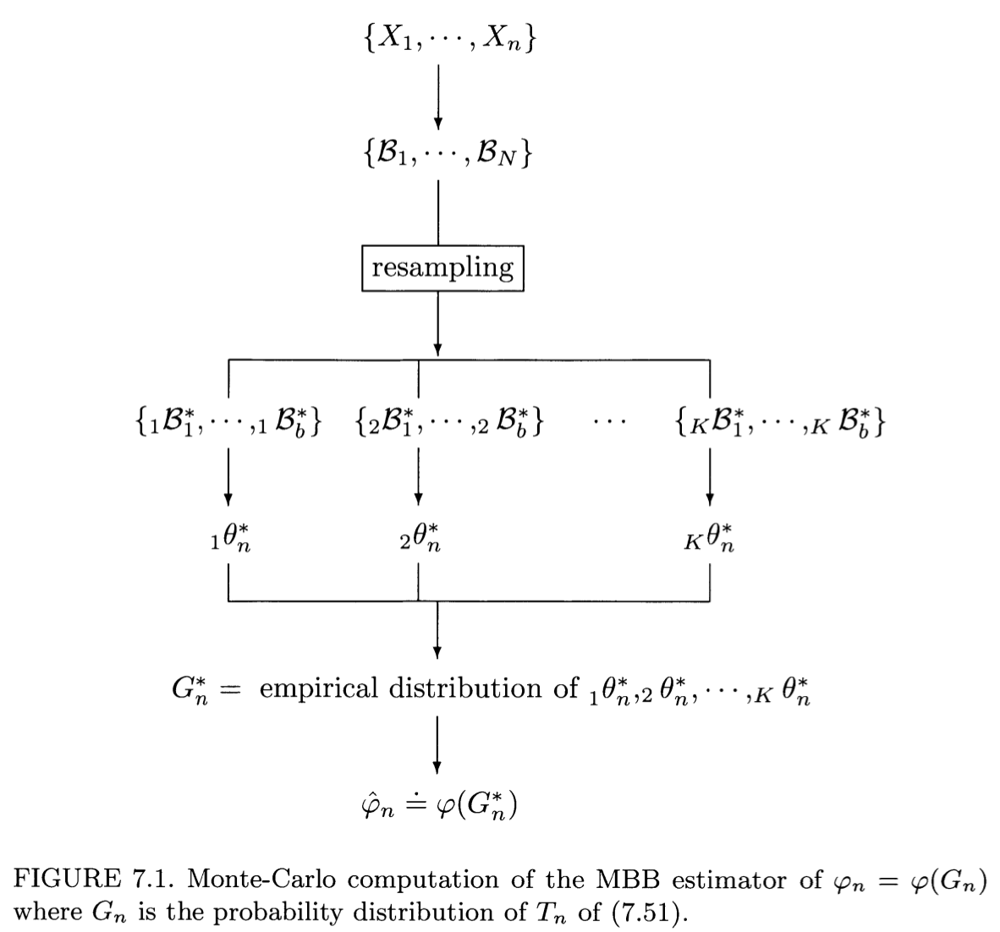
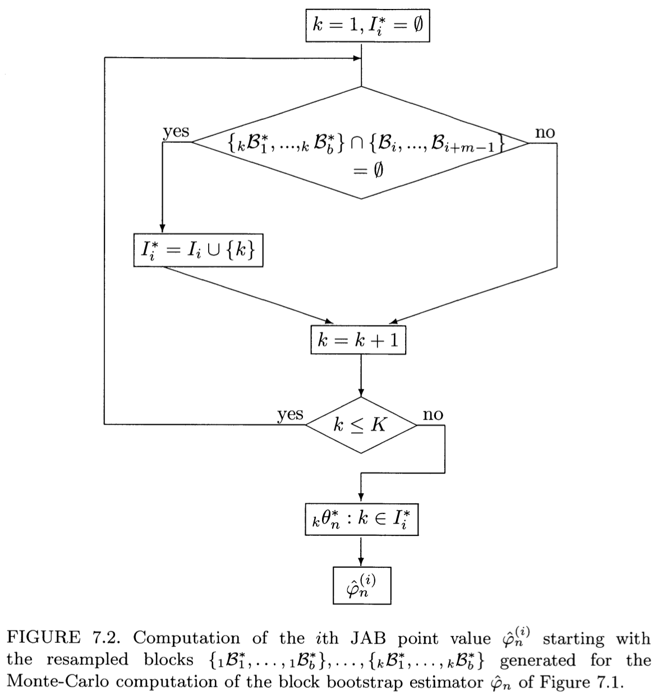

I'm excited to announce that `blocklength` 0.2.0 is now available on [CRAN](https://cran.r-project.org/package=blocklength)! `blocklength` is designed to be used with block-bootstrap procedures and makes it quick and easy to select a block-length quantitatively. This significant update includes a new block-length selection algorithm by [Lahiri, Furukawa, and Lee    (2007)](https://doi.org/10.1016/j.stamet.2006.08.002), the nonparametric plug-in “NPPI” method.

Install it with:

```{r install, eval=FALSE}
install.packages("blocklength")
```

The most important changes are highlighted below and you can see a full list of changes in the [changelog](https://alecstashevsky.com/r/blocklength/news).


## New Features

The new `nppi()` function and its corresponding S3 plot method `plot.nppi()` can be used in a similar manner to other algorithms already present in the library. Documentation can be found at the package [website](https://alecstashevsky.com/r/blocklength). The NPPI method brings additional flexibility for users, and extends the usefulness of the package to a wider-range of estimators including bias, variance, distribution function, and quantile estimators. 


## The NPPI Algorithm

The NPPI algorithm is based on theoretical foundations first described in the seminal paper by [Hall, Horowitz, and Jing    (1995)](https://doi.org/10.1093/biomet/82.3.561) "HHJ", who proposed the first optimal block-length selection algorithm for the block-bootstrap. Their `hhj()` algorithm has been part of `blocklength` since the beginning, but the NPPI method both relaxes the assumptions of the HHJ method and extends it to a wider range of estimators.

HHJ show that for many block bootstrap estimators, the variance of the bootstrap estimator is an increasing function of the block-length $\ell$ while its bias is a decreasing function of $\ell$. In equations (2.1) and (2.2), Lahiri, Furukawa, and Lee (2007) show that under suitable regularity conditions, the bias and variance estimators can be expanded such that:

$$
n^{2a} \cdot \text{Var}(\hat{\varphi}_n(\ell)) = C_1 n^{-1} \ell^r + o(n^{-1} \ell^r) \quad \text{as } n \to \infty
$$

$$
n^a \cdot \text{Bias}(\hat{\varphi}_n(\ell)) = C_2 \ell^{-1} + o(\ell^{-1}) \quad \text{as } n \to \infty
$$

where $C_1$ and $C_2$ are population parameters. 

The key finding from Lahiri, Furukawa, and Lee (2007) is that rather than deriving analytical expressions for these population constants, we can use nonparametric resampling methods (*i.e.* the moving block-bootstrap and the moving-blocks-jackknife) to estimate them directly. Moreover, these estimators are shown to be consistent under the regularity conditions of HHJ.

Putting this all together, NPPI has the following three steps:

  1. Compute the bias estimator using the moving block-bootstrap (MBB).
  2. Use the bootstrap replicates (blocks) from (1) to compute the variance estimator using the moving-blocks-jackknife (MBJ).
  3. Compute the population parameter estimates $\hat{C_1}$ and $\hat{C_2}$ and the final estimator for the optimal block-length.


### Step 1

Bias estimation is done via a very neat trick. We simply compute the block-bootstrap for a chosen block-length $\ell$ and then $2\ell$. The bias estimator is then simply given by equation (3.9):

$$
\widehat{\text{BIAS}}_n \equiv \widehat{\text{BIAS}}_n(\ell) = 2 \left( \hat{\varphi}_n(\ell) - \hat{\varphi}_n(2\ell) \right).
$$

A diagram of the MBB estimator $\hat{\varphi}_n$ is given in Lahiri (2003) *Resampling methods for dependent data,* Figure 7.1:




### Step 2

Variance estimation is computed using the moving-blocks-jackknife (MBJ) method of [Liu and Singh (1992)](https://doi.org/10.1214/aos/1176348653). The MBJ method is a generalization of the jackknife-after-bootstrap method of [Efron (1992)](https://doi.org/10.1111/j.2517-6161.1992.tb01866.x) to the block-bootstrap. The MBJ method is a very clever way to estimate the variance of a block-bootstrap estimator because we can simply regroup the resampled blocks from *Step 1* without recomputing the entire block-bootstrap for each iteration. 

For each of of the resampled blocks-sets created from the MBB, we first delete $m$ consecutive blocks (this set of blocks is referred to as the *block-of-blocks*), resample the remaining blocks randomly with replacement, and compute the $i^{th}$ jackknife point value $\hat{\varphi}^{(i)}_n$ by re-using the MBB estimator $\hat{\varphi}_n$. We calculate the JAB point values a total of $M$ times and then compute the JAB variance estimator following equation (3.6):

$$
\widehat{\text{VAR}}_{\text{JAB}}(\hat{\varphi}_n) =
\frac{m}{(N - m)} \frac{1}{M} \sum_{i=1}^{M} \left( \tilde{\varphi}_n^{(i)} - \hat{\varphi}_n \right)^2
$$

where $\tilde{\varphi}_n^{(i)} = m^{-1} \left[ N \hat{\varphi}_n - (N - m) \hat{\varphi}_n^{(i)} \right]$.

A diagram of the JAB point value computation is given by Lahiri (2003), Figure 7.2:




### Step 3

The final step is to compute the NPPI estimator of the optimal block-length $\hat{\ell}^0$, given by equation (4.15):

$$
\hat{\ell}^0 = \left[ \frac{2 \hat{C}_2^2}{r \hat{C}_1} \right]^{\frac{1}{r+2}} n^{\frac{1}{r+2}}
$$
where $\hat{C}_1 = n \ell^{-r} \widehat{\text{VAR}}$ and $\hat{C}_2 = \widehat{\text{BIAS}}_n$. 


## Conclusion

Implementing the NPPI method was essentially a very fun exercise in meta-resampling. It makes use of the two most popular resampling methods, the *bootstrap* and the *jackknife*, as a means to estimate parameters for the block-bootstrap: itself a resampling algorithm. The NPPI method is a great addition to `blocklength` and I hope it will be useful to researchers and practitioners alike!
