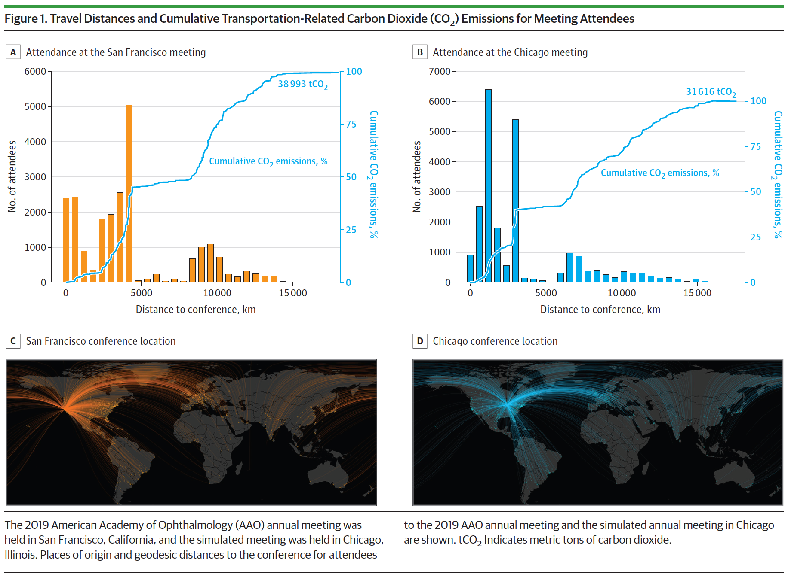

 

<a href="https://doi.org/10.1001/jamaophthalmol.2023.3516">
Read the full article here!
</a>

 

## Notes

If you are interested in viewing further visualizations or the analysis itself, there is a comprehensive repository containing all the R code used to generate the plots and model the attendee emissions available at my [GitHub.](https://github.com/Alec-Stashevsky/AAO-climate-research)

I would like to thank my coauthors, especially Dr. Scott McClintic for the opportunity to participate in this important research.

Please feel free to reach out with any questions or if you are interested in performing a similar study for another conference. 
